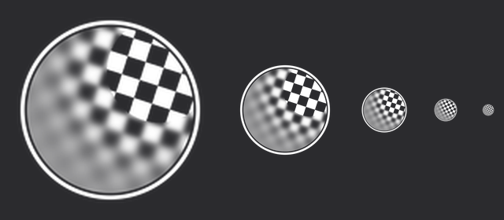
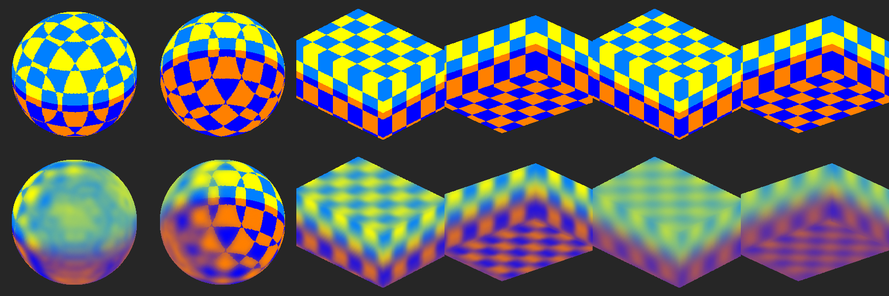
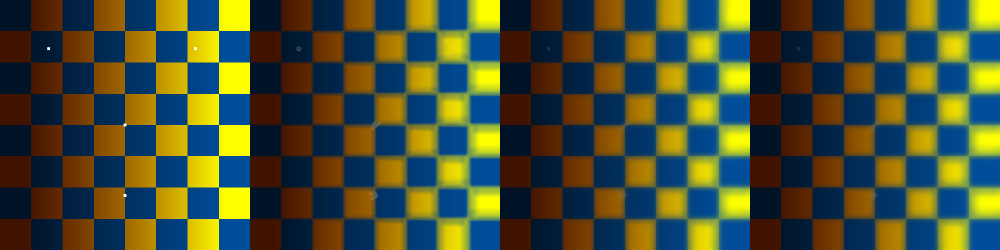

# World Space Non Uniform Blur

A Substance Designer / Substance Painter filter that does the **Non-Uniform Blur**
(bokeh blur scaled by a blur map, with Samples / Intensity / Anisotropy / Blades / Angle)
**in 3D, using the mesh position**, so the result is continuous across UV seams.
It is built the same way as *World Space Mask Blur*.

`world_space_non_uniform_blur.sbs` contains two graphs:

| Graph | Use |
|---|---|
| `world_space_non_uniform_blur` | colour input / output (any channel) |
| `world_space_non_uniform_blur_grayscale` | grayscale input / output (masks) |

Icon (`docs/icon.svg`, generated by `tools/make_icon.py` and embedded in both graphs): a sphere whose checker stays crisp in one area (where the blur map is black) and is blurred more and more away from it.



## Inputs

| Input | |
|---|---|
| Input | the image to blur |
| Blur Map | optional grayscale map that scales the blur per texel (white = full Intensity, black = none). Only used when **Use Input As Blur Map** is off. |
| Mesh Position | the baked position map |
| Mesh UV Mask | the UV mask (texels outside it are passed through) |

## Parameters

**Blur** (same meaning as the 2D Non-Uniform Blur)

- **Samples** (1–16): the number of blur passes. Each pass averages the centre with `Blades` taps on a polygon, and the radius shrinks from pass to pass, which fills the bokeh shape.
- **Intensity**: the blur radius, in the same units as the 2D filter (1 = 1/256 of the UV space; default 10). It is converted to world space using the mesh's average texel density, so islands with very different texel density blur by the same world size rather than by the same number of pixels.
- **Anisotropy**: squashes the shape across the Angle direction (1 = a line).
- **Blades** (1–9): the number of polygon sides.
- **Angle**: rotation of the shape around the surface normal.
- **Use Blur Map** (on by default): scale the blur per texel. When off, the blur is uniform.
- **Use Input As Blur Map** (on by default): use the luminance of the Input itself as the blur map, like plugging the layer below into both inputs of the 2D filter. Turn it off to use the Blur Map input instead.
- **Invert Blur Map**: blur the dark areas instead of the bright ones.

**World Space**

- **Softness**: blurs every tap a little. This makes the result smoother and lets the blur wrap around hard edges and curved areas. At 0 you get the sharpest bokeh shape.
- **Quality** (1–4): the voxel grid size, 48³ / 64³ / 96³ / 128³.
- **Reference Axis X/Y/Z**: the object-space direction that Angle 0 points to. It is projected onto the surface. The default is +Y (up), so Anisotropy gives vertical streaks.
- **Dither**: hides 8-bit banding.

## How it works

1. **Voxelization** (identical to World Space Mask Blur): bounding box, 512×512 surface samples with area weights, a bitonic sort of the samples into a 128³ hash grid, and per-voxel ranges.
2. **Splat**: two gather passes build a voxel atlas of `(colour·w, w)` and a frame atlas of `(surface normal, blur amount)`. The normal comes from the dominant eigenvector of the normal tensor, so mirrored UV islands don't cancel out.
3. **Non-uniform passes** (up to 16): each voxel averages its centre and `Blades` taps. The taps sit on the 2D Non-Uniform Blur's ellipse (same angles, inner rotation, anisotropy and radius decay `exp(-2k·√(-ln 0.001)/N)` with `N = min(Samples, ⌈Intensity·π⌉)` passes), placed in the voxel's tangent plane and scaled by the voxel's blur amount. Taps read a 5-level voxel mip pyramid, which is what Softness controls, so taps that leave the surface still find it.
4. **Resolve**: a cubic B-spline lookup at every texel's position. It is blended with the original texel where the local radius is below about 2 voxels, so unblurred areas stay sharp.



Flat-plane comparison with the 2D Non-Uniform Blur (input used as its own blur map, Intensity 10): input, 2D filter, this filter at Softness 0.25, this filter at Softness 0.



## Rebuilding / testing

The package is generated by a script; don't edit the `.sbs` by hand:

```
python3 tools/build_wsnub.py                      # writes world_space_non_uniform_blur.sbs
pip install numpy pillow scipy
python3 tools/test_wsnub.py sphere out use_blur_map=1 intensity=12   # renders out.png
```

`tools/sbsinterp.py` is a small numpy interpreter for pixel-processor graphs. It
runs the actual `.sbs` file on synthetic meshes (a cube-mapped sphere or box with 6 UV islands, one of them
mirrored). It runs the original World Space Mask Blur correctly, and the voxelization nodes of
this package match that file's outputs bit for bit.

## Notes

- This was only tested with the interpreter above, not yet inside Substance Designer / Painter.
- The orientation of the bokeh (Angle, odd Blades) is mirrored on mirrored UV islands, as it is in the 2D filter.
  The Reference Axis can't be projected where the surface faces straight along it, so those spots fall back to the X (or Z) axis.
- Performance: the voxelization (bounds, sort, normals) depends only on the mesh and Quality, so it is computed once.
  Changing the input or the blur-map options re-runs one splat, and moving any other slider only re-runs the
  `N` blur passes and the final lookup. Voxel textures are 16-bit float, each tap reads 2 mip levels, and texels
  with no blur skip the voxel lookup. If it is still too slow, lower **Quality** (3 is about half the work of 4)
  and apply the filter only to the channels that need it, since Painter runs a filter once per channel.
- Detail finer than one voxel (1/122 of the mesh size at Quality 4) can't be represented, so very small blurs are a little softer than the 2D filter's.
